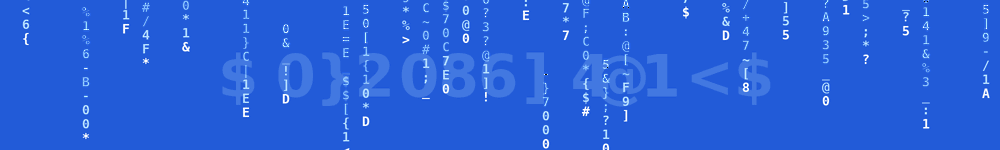

  

I’m **Mahesa F. Ferdinand**, leading Zerolinear and building practical, open-source AI agents. I care about developer-first systems that stay under your control: portable across model providers, extensible with real tools, and deployable on infrastructure you own.

I’m building **Zeline**, an open-source, model-agnostic, self-hostable agentic AI framework for agents that reason, use tools, connect to external systems, and complete multi-step workflows. It brings together an OpenAI-compatible agent loop, persistent memory and sessions, messaging gateways, web research, browser control, local files, APIs, scheduled jobs, and custom tools.

Currently focused on `Agentic AI`, `LLM Infrastructure`, `Agent Evaluation`, and `Observability`.
